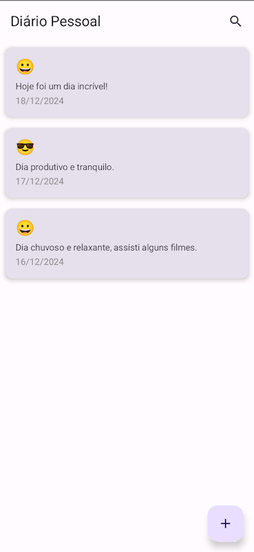

# 📓 DiaryApp

**DiaryApp** é um aplicativo Android minimalista para registro de emoções e pensamentos diários. O projeto foi desenvolvido com foco em boas práticas de desenvolvimento, segurança e uma interface moderna utilizando Jetpack Compose.

---

## 🛠️ Funcionalidades
- **Registro de Emoções e Pensamentos**: Adicione entradas diárias com data, humor e descrição.
- **Busca Personalizada**: Filtre entradas por emojis de humor ou palavras-chave.
- **Segurança com SQLCipher**: Banco de dados protegido por criptografia para garantir a privacidade dos dados.
- **Interface Moderna**: Desenvolvida com Material 3 e Jetpack Compose, oferecendo uma experiência de usuário fluida e responsiva.
- **Filtros Interativos**: Escolha emojis com destaque para melhorar a usabilidade.

---

## 🧑‍💻 Tecnologias Utilizadas
- **Kotlin**: Linguagem principal do projeto.
- **Jetpack Compose**: Para criação de interfaces modernas e reativas.
- **Room com SQLCipher**: Banco de dados local protegido por criptografia.
- **Hilt**: Injeção de dependência para modularidade e facilidade de testes.
- **Material 3**: Design system para uma interface elegante.
- **StateFlow**: Para gerenciamento de estado reativo.

---

## 📲 Como Rodar o Projeto
1. **Clone o Repositório**:
   ```bash
   git clone https://github.com/seu-usuario/DiaryApp.git
   cd DiaryApp
   ```

2. **Configure o Ambiente**:
    - Certifique-se de que você tenha o Android Studio atualizado.
    - Defina a **versão mínima do SDK** para 26.

3. **Instale as Dependências**:
    - Abra o projeto no Android Studio.
    - Sincronize o Gradle para baixar as dependências.

4. **Execute o App**:
    - Conecte um dispositivo ou emulador Android.
    - Clique em **Run** no Android Studio.

---

## 🚀 Funcionalidades Planejadas
- Melhorias na experiência do usuário.
- Exportação e importação de entradas.
- Notificações diárias para lembretes.

---

## 🛡️ Segurança
- **Banco Criptografado**:
    - Utiliza SQLCipher para proteger os dados no banco.
    - Geração de passphrase segura utilizando `EncryptedSharedPreferences`.

---

## 📄 Licença
Este projeto está sob a licença MIT. Veja o arquivo [LICENSE](LICENSE) para mais detalhes.

---

## 📷 Screenshots

